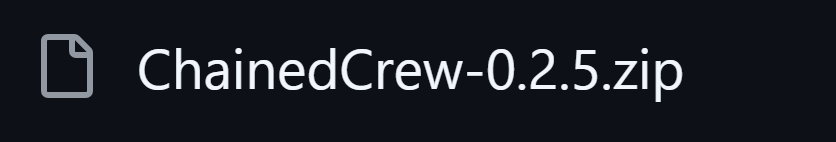
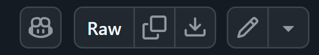
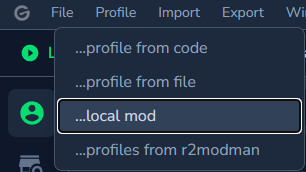

# Lethal Mods

사용 전, 라이선스를 읽어주세요.  
리썰 컴퍼니 유튜브 컨텐츠에 유용한 모드를 모았습니다.

---

## 설치 방법

아래 순서대로 설치하면 됩니다.

### 1. 원하는 모드 ZIP 파일을 다운로드합니다.

원하는 파일을 클릭합니다.

클릭한 후, 다운로드 버튼을 누릅니다.

- 예: `ChainedCrew-0.2.5.zip`

### 2. 모드 매니저에서 로컬 모드로 불러옵니다.

`Import` → `...local mod`

어떤 모드 매니저라도 로컬 파일 불러오기 기능이 존재하며,
만약 기능을 지원하지 않거나 모드 매니저를 사용중이지 않더라도 수동 설치하실 수 있습니다.

### 3. 다운로드한 ZIP 파일을 선택해 추가합니다.

- 방금 다운로드한 모드 ZIP 파일을 선택합니다.
- 여러 모드를 사용할 경우, 같은 방식으로 하나씩 추가하면 됩니다.

---

## 모드 설명

### ChainedCrew
플레이어끼리 사슬처럼 연결되는 모드입니다.  

### ForbiddenKey
게임을 시작하면 조작 키 하나가 잠기는 모드입니다.  

### KeyShuffle
2분마다 조작 키가 랜덤하게 바뀌는 모드입니다.  

### PositionCycle
1분마다 플레이어들의 위치가 서로 바뀌는 모드입니다.  

### ScrapEggMayhem
모든 스크랩이 이스터 에그처럼 폭발하는 모드입니다.  

### SharedHealth
모든 플레이어가 체력을 공유하는 모드입니다.  
